# 📚 Book Library API

API REST desarrollada con **Node.js**, **Express**, **MongoDB** y **Mongoose** para la gestión de una biblioteca de libros.

## 🚀 Tecnologías utilizadas

* Node.js
* Express
* MongoDB
* Mongoose
* Postman
* Docker

---

## 🐳 Docker

MongoDB se ejecuta dentro de un contenedor Docker.

#### Resultado

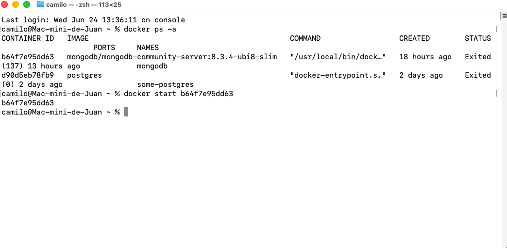

---

## 📖 Modelo de datos

```json
{
  "title": "Harry Potter y la piedra filosofal",
  "author": "J.K. Rowling",
  "genre": "Fantasía",
  "pages": 223,
  "read": true
}
```

---

## 🔗 Endpoints

### Obtener todos los libros

```http
GET /books
```

#### Resultado

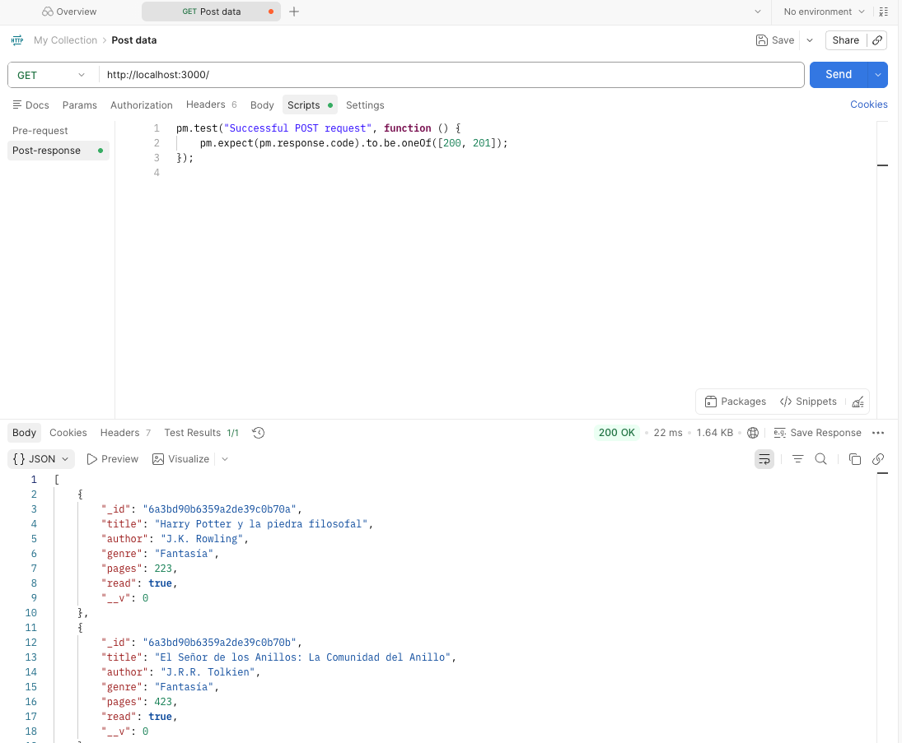

---

### Obtener un libro por title

```http
GET /books/title/:title
```

#### Resultado

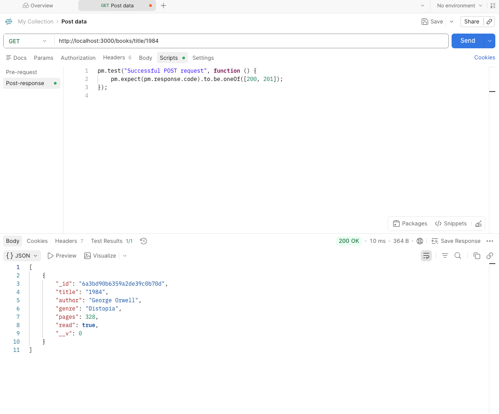

---

### Obtener un libro por ID

```http
GET /books/:id
```

#### Resultado

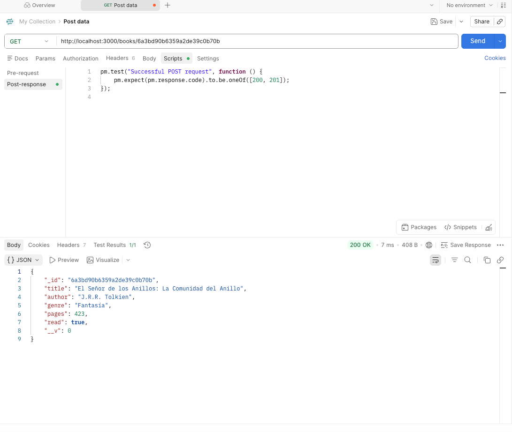

---

### Obtener un libro por genero

```http
GET /books/genre/:genre
```

#### Resultado

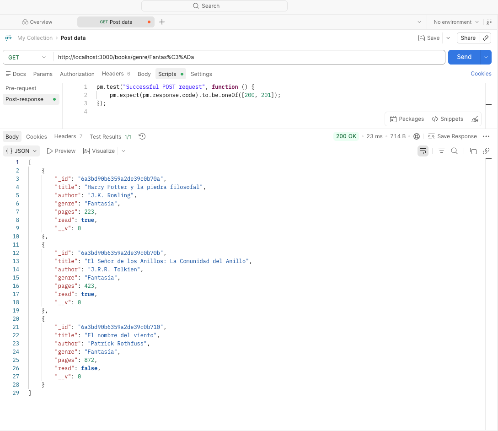

---

### Obtener un libro por read

```http
GET /books/read/:read
```

#### Resultado

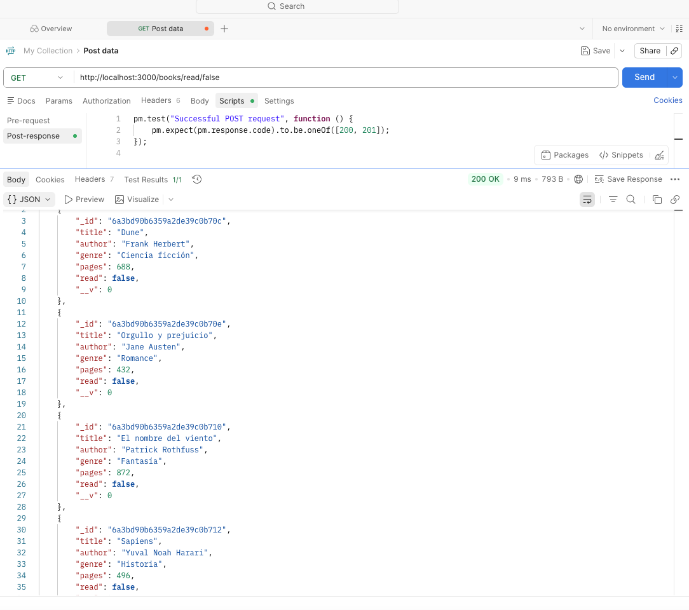

---

### Crear un libro

```http
POST /books
```

#### Body

```json
{
  "title": "Dune",
  "author": "Frank Herbert",
  "genre": "Ciencia ficción",
  "pages": 688,
  "read": false
}
```

#### Resultado

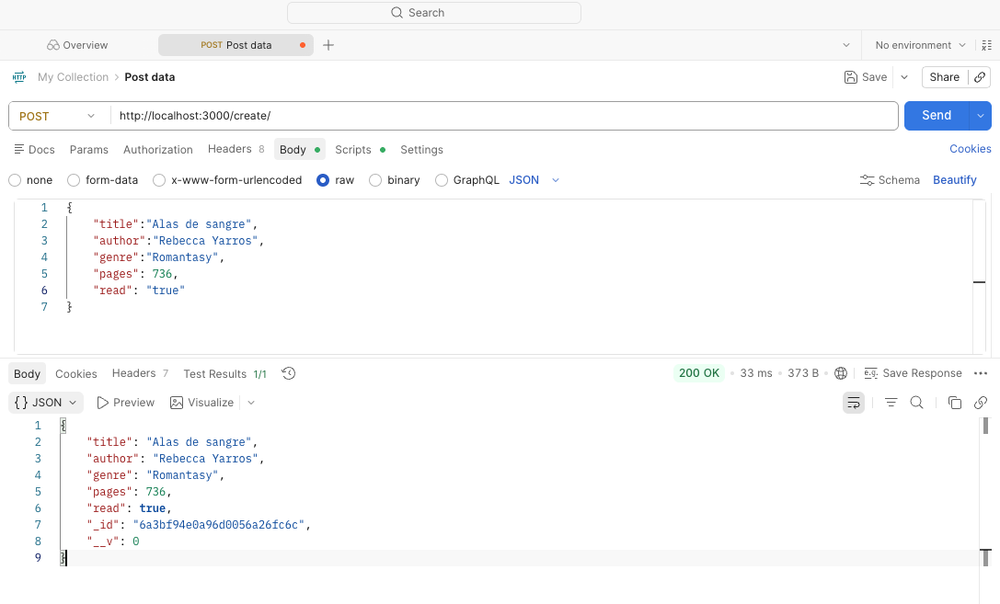

#### Resultado en la BD
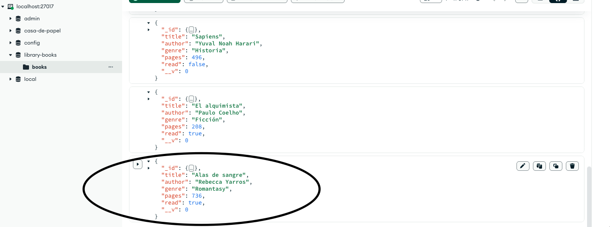

---

### Actualizar un libro

```http
PUT /books/:id
```

#### Resultado

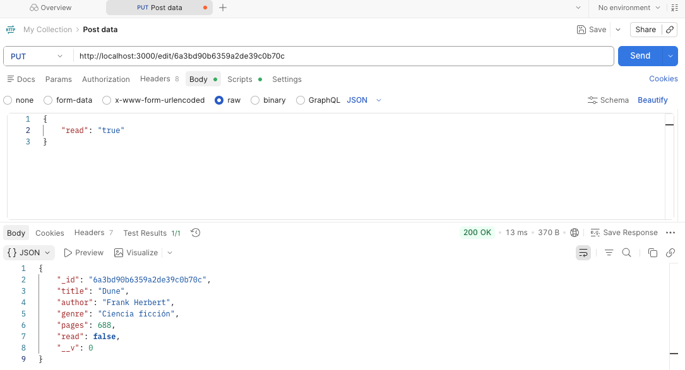

#### Resultado en la BD
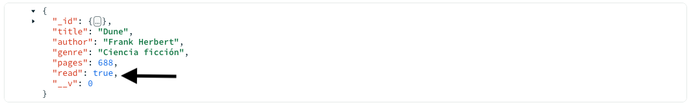

---

### Eliminar un libro

```http
DELETE /books/:id
```

#### Resultado

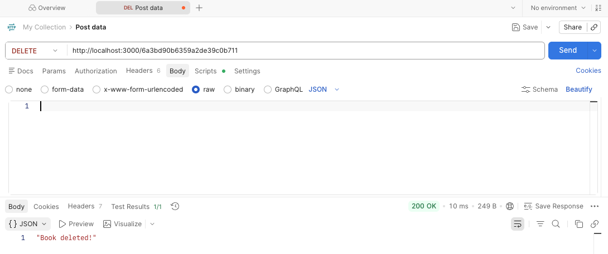

---

## 🗄️ Base de datos

La aplicación utiliza MongoDB como base de datos NoSQL y Mongoose como ODM para la gestión de los modelos.

### Conexion a BD

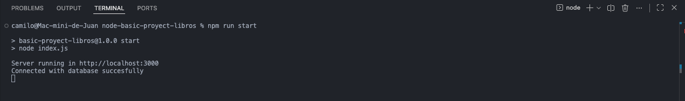

### Insercion de datos a la BD

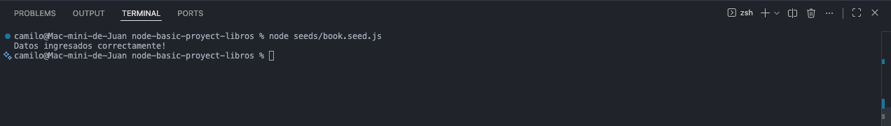

### Base de datos 

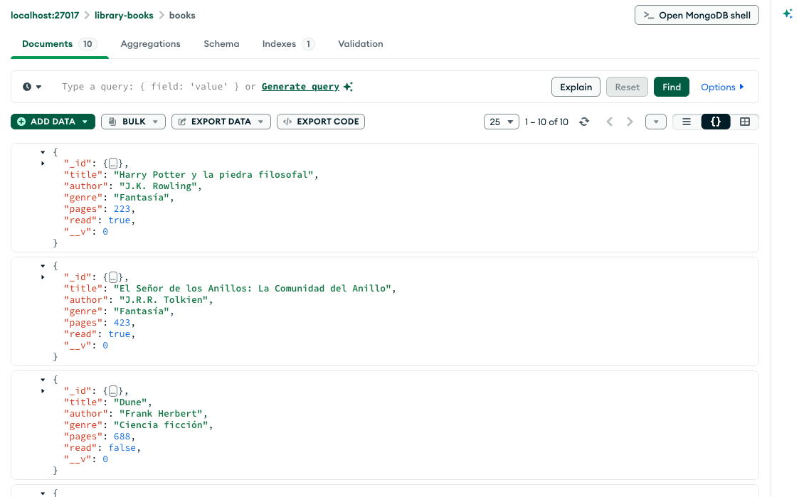

---


## 👨‍💻 Autor

Proyecto desarrollado como práctica de API REST utilizando Node.js, Express y MongoDB.